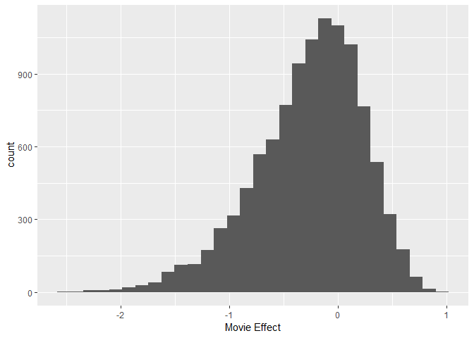
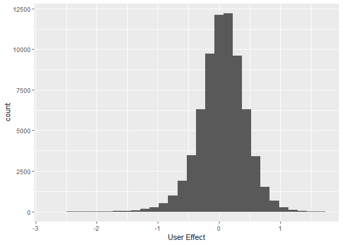
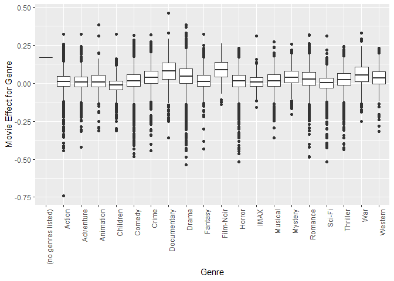
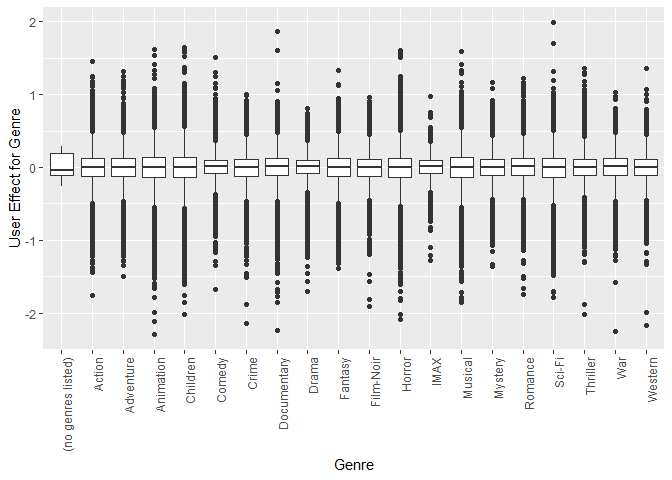

Recommendation System Report
================
Anil Nanayakkara
March 1, 2019

R Markdown
----------

Machine Learning Algorithm for Movie Recommendation System

    ## Loading required package: tidyverse

    ## -- Attaching packages -------------------------------------------------------------------------------------------------- tidyverse 1.2.1 --

    ## v ggplot2 3.1.0     v purrr   0.2.5
    ## v tibble  1.4.2     v dplyr   0.7.8
    ## v tidyr   0.8.2     v stringr 1.3.1
    ## v readr   1.2.1     v forcats 0.3.0

    ## -- Conflicts ----------------------------------------------------------------------------------------------------- tidyverse_conflicts() --
    ## x dplyr::filter() masks stats::filter()
    ## x dplyr::lag()    masks stats::lag()

    ## Loading required package: caret

    ## Loading required package: lattice

    ## 
    ## Attaching package: 'caret'

    ## The following object is masked from 'package:purrr':
    ## 
    ##     lift

    ## Joining, by = c("userId", "movieId", "rating", "timestamp", "title", "genres")

EXECUTIVE SUMMARY

The goal of this project was to come up with a machine learning algorithm to predict what rating a user may give a movie based on movies he/she and other users have rated in the past. The main strategy was reducing the individual movie rating over the mean rating of all movies into different effects or biases. These effects were then be used to predict movie and user combinations that have not been rated before.

DATA SET

The data set included 10 million movie ratings by 69878 users for 10677 movies

OBSERVATIONS

1.  Movies that are better have a better rating that poor movies which users do not like.

2.  Different users rate the same movies differntly.

3.  Some movie genres get higher movie ratings than others.

4.  Users rate movies in some genres differently that other genres.

ANALYSIS

The approach taken to finding a solution to this problem was to calculate an average rating for all movies and then decompose the difference between the actual movie rating and the average for all all movies (mu) based on the observations on the data.

This resulted in obtaing the factors that contribute to the rating in the following way.

From observation (1) -&gt; b\_i = avg rating (for movie) - mu (movie effect) (2) -&gt; b\_u = avg rating (for user) - mu - bi (user effect) (3) -&gt; b\_ig = avg rating (for movie within genre) - b\_i - b\_u (movie effect for genre) (4) -&gt; b\_ug = avg rating (for user within genre) - b\_i - b\_u - b\_ig (user effect for genre)

These factors are then stored in separate lists and a prediction is made by adding up the factors:

prediction = mu + b\_i + b\_u + b\_ig + b\_ug

DATA CLEANSING AND EXPLORATION

The following strategies were followed to overcome problems inherent in the data.

1.  movieId - was stored in a numeric vector, but some movieIds had a leading space. This made it difficult to vectorize the given dataframe by applying logic to rows of the data set. To overcome this, vectors of movieId, userId and genres where extracted from the dataframe and applied as vectors using the mapply function.

2.  genres - were stored as a list which needed to be separated. It was assumed that the same list of genres where applied to a particular movieId and in the same order as this is usually done in the data cleansing phase.

3.  Movies that were rated very few times were rated very high or very low. In order to penalize such cases, the algorithm regularized the rating with lamda value of 5 (since there are 4 effects that are being regularized a higher value was used)

RESULTS

The final Root Mean Square Error calculated was:

| method                                  |       RMSE|
|:----------------------------------------|----------:|
| RMSE for Movie Recommendation Algorithm |  0.8537573|

VISUALIZATIONS

The following plots show how the effects used in the algorithm contributes to an accurate prediction.

    ## `stat_bin()` using `bins = 30`. Pick better value with `binwidth`.

    ## `stat_bin()` using `bins = 30`. Pick better value with `binwidth`.

CONCLUSION

The visualization shows that the effects used in the algorithm were significant in recommending movies based on prediction from those effects. There are diffences in movie effects for genres for individual movies as well as their means. On the other hand even though the means do not change much for user effects for genres, the individual user effects across genres do vary more prominently. The overall movie effect also shows a left skewed distribution where as the overall user effect is more normally distributed.
